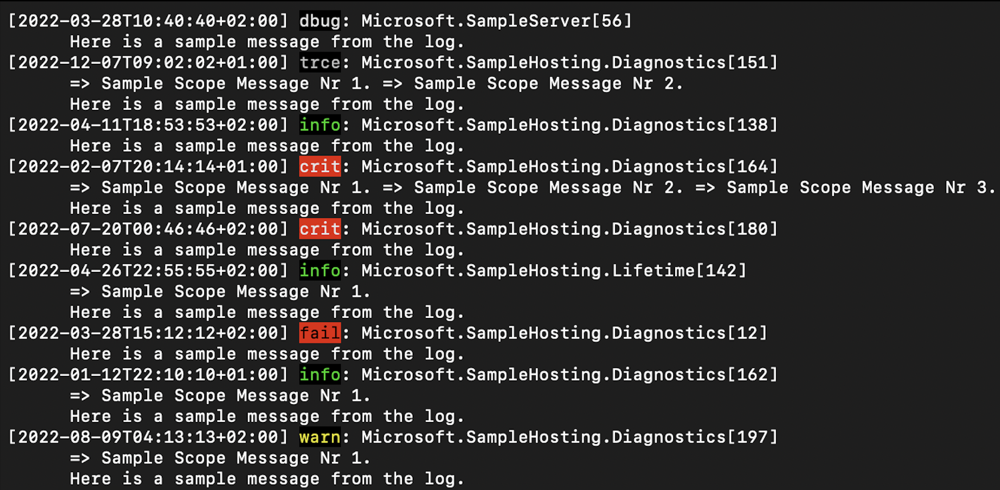

# JSON Log View Tool for Console logs

**JSON Log View Tool for Console logs** is a utility for viewing JSON log streams on the console in .NET ecosystem.

The tool analyses the input streams and parses the JSON console log lines, if happen to be in the stream, 
into the Simple Console format, that wraps information in each log for the sake of better readability. 

> All the contents of the stream that are **NOT** JSON console logs, are output without being reformatted.

- JSON input of a different format is printed out without being modified. 
- The program terminates at the end of the input stream or at pressing `CTRL-C`.

### Example

An example of input logs in JSON Console format BEFORE:

```json lines
{"Timestamp":"2022-08-15T14:54:54+02:00","EventId":21,"LogLevel":"Error","Category":"Microsoft.SampleServer","Message":"Here is a sample message from the log.","Scopes":[{"Message":"Sample Scope Message Nr 1."}]}
{"Timestamp":"2022-04-14T05:05:05+02:00","EventId":127,"LogLevel":"Information","Category":"Microsoft.SampleHosting.Diagnostics","Message":"Here is a sample message from the log."}
{"Timestamp":"2022-07-17T05:05:05+02:00","EventId":169,"LogLevel":"Information","Category":"Microsoft.SampleHosting.Diagnostics","Message":"Here is a sample message from the log.","Scopes":[{"Message":"Sample Scope Message Nr 1."},{"Message":"Sample Scope Message Nr 2."},{"Message":"Sample Scope Message Nr 3."},{"Message":"Sample Scope Message Nr 4."}]}
{"Timestamp":"2022-02-02T14:10:10+01:00","EventId":89,"LogLevel":"Warning","Category":"Microsoft.SampleServer","Message":"Here is a sample message from the log.","Scopes":[{"Message":"Sample Scope Message Nr 1."},{"Message":"Sample Scope Message Nr 2."},{"Message":"Sample Scope Message Nr 3."}]}
{"Timestamp":"2022-01-28T19:53:53+01:00","EventId":46,"LogLevel":"Information","Category":"Microsoft.SampleHosting.Lifetime","Message":"Here is a sample message from the log.","Scopes":[{"Message":"Sample Scope Message Nr 1."},{"Message":"Sample Scope Message Nr 2."},{"Message":"Sample Scope Message Nr 3."}]}
{"Timestamp":"2022-03-09T14:02:02+01:00","EventId":44,"LogLevel":"Trace","Category":"Microsoft.SampleHosting.Lifetime","Message":"Here is a sample message from the log.","Scopes":[{"Message":"Sample Scope Message Nr 1."},{"Message":"Sample Scope Message Nr 2."}]}

```
The console output AFTER:
```
[2022-08-15T14:54:54+02:00] fail: Microsoft.SampleServer[21]
      => Sample Scope Message Nr 1. 
      Here is a sample message from the log.
[2022-04-14T05:05:05+02:00] info: Microsoft.SampleHosting.Diagnostics[127]
      Here is a sample message from the log.
[2022-07-17T05:05:05+02:00] info: Microsoft.SampleHosting.Diagnostics[169]
      => Sample Scope Message Nr 1. => Sample Scope Message Nr 2. => Sample Scope Message Nr 3. => Sample Scope Message Nr 4. 
      Here is a sample message from the log.
[2022-02-02T14:10:10+01:00] warn: Microsoft.SampleServer[89]
      => Sample Scope Message Nr 1. => Sample Scope Message Nr 2. => Sample Scope Message Nr 3. 
      Here is a sample message from the log.
[2022-01-28T19:53:53+01:00] info: Microsoft.SampleHosting.Lifetime[46]
      => Sample Scope Message Nr 1. => Sample Scope Message Nr 2. => Sample Scope Message Nr 3. 
      Here is a sample message from the log.
[2022-03-09T14:02:02+01:00] trce: Microsoft.SampleHosting.Lifetime[44]
      => Sample Scope Message Nr 1. => Sample Scope Message Nr 2. 
      Here is a sample message from the log.
```

## Use the utility as a .NET Core global tool

Target Framework: .NET 6.0.

1. Install the tool from the package by running the [dotnet tool install](https://docs.microsoft.com/en-us/dotnet/core/tools/dotnet-tool-install) command in the src/Nyris.JsonLogView` directory.
Installing it as a global tool gives an ability to process logs of any source globally.
```
dotnet tool install --global nyris.jsonlogview
```

2. Invoke the tool:
```
dotnet run [--project <PATH>]|jsonlogview
```
3. Remove the tool by running [dotnet tool uninstall](https://docs.microsoft.com/en-us/dotnet/core/tools/dotnet-tool-uninstall) command from any directory:

```
dotnet tool uninstall -g nyris.jsonlogview
```

## Commands

### Root command
Invokes the main functionality:
```
dotnet run [--project <PATH>]|jsonlogview
```

#### Options:

- `-c, --color`: Log level displayed in color. Highlights the log levels of the logs in standard colors for the even better readability and easiness to track the events.



- `-s, --no-scopes`: Disables the display of scopes for a more compact look.
```
[2022-02-20T20:33:33+01:00] trce: Microsoft.SampleServer[155]
      Here is a sample message from the log.
[2022-02-20T23:13:13+01:00] trce: Microsoft.SampleHosting.Lifetime[96]
      Here is a sample message from the log.
[2022-04-05T21:04:04+02:00] crit: Microsoft.SampleHosting.Diagnostics[161]
      Here is a sample message from the log.
[2022-04-20T14:18:18+02:00] info: Microsoft.SampleServer[78]
      Here is a sample message from the log.
[2022-01-24T03:34:34+01:00] crit: Microsoft.SampleHosting.Diagnostics[152]
      Here is a sample message from the log.
[2022-12-02T17:29:29+01:00] fail: Microsoft.SampleServer[93]
      Here is a sample message from the log.
[2022-02-24T10:21:21+01:00] crit: Microsoft.SampleServer[40]
      Here is a sample message from the log.
```

- `-t, --no-timestamp`: Disables the display of timestamps for a more compact look.
```
trce: Microsoft.SampleServer[26]
      => Sample Scope Message Nr 1.
      Here is a sample message from the log.
crit: Microsoft.SampleHosting.Lifetime[115]
      Here is a sample message from the log.
dbug: Microsoft.SampleHosting.Diagnostics[149]
      => Sample Scope Message Nr 1.
      Here is a sample message from the log.
fail: Microsoft.SampleServer[43]
      => Sample Scope Message Nr 1. => Sample Scope Message Nr 2.
      Here is a sample message from the log.
crit: Microsoft.SampleServer[53]
      => Sample Scope Message Nr 1. => Sample Scope Message Nr 2. 
      Here is a sample message from the log.
warn: Microsoft.SampleHosting.Diagnostics[54]
      => Sample Scope Message Nr 1. => Sample Scope Message Nr 2.  
      Here is a sample message from the log.
```

### Pretty command
Aligns the scopes messages for a more structured look:
```
dotnet run [--project <PATH>]|jsonlogview pretty
```
```
[2022-10-19T11:35:35+02:00] fail: Microsoft.SampleHosting.Diagnostics[104]
      => Sample Scope Message Nr 1. 
      => Sample Scope Message Nr 2. 
      => Sample Scope Message Nr 3. 
      Here is a sample message from the log.
[2022-04-05T19:32:32+02:00] info: Microsoft.SampleHosting.Diagnostics[172]
      => Sample Scope Message Nr 1. 
      => Sample Scope Message Nr 2. 
      => Sample Scope Message Nr 3. 
      => Sample Scope Message Nr 4. 
      Here is a sample message from the log.
[2022-11-12T18:24:24+01:00] crit: Microsoft.SampleHosting.Lifetime[49]
      => Sample Scope Message Nr 1. 
      Here is a sample message from the log.
[2022-04-13T04:35:35+02:00] info: Microsoft.SampleHosting.Lifetime[133]
      => Sample Scope Message Nr 1. 
      => Sample Scope Message Nr 2. 
      Here is a sample message from the log.
```

#### Options:
- `-c, --color`: Log level displayed in color. Highlights the log levels of the logs in standard colors for the even better readability and easiness to track the events.
- `-t, --no-timestamp`: Disables the display of timestamps for a more compact look.

## Sample applications

The solution contains three sample applications for an ease of testing:

1. **[Nyris.JsonLogView.SimpleTest](samples/Nyris.JsonLogView.SimpleTest)** - random logs in Simple Console format are being generated and printed out.
```
[04/09/2022 15:58:58Z] fail: Microsoft.SampleHosting.Diagnostics[94] 
      => Sample Scope Message Nr 1. => Sample Scope Message Nr 2. => Sample Scope Message Nr 3. => Sample Scope Message Nr 4. 
      Here is a sample Message from the log.
[04/26/2022 18:31:31Z] trce: Microsoft.SampleHosting.Lifetime[44] 
      => Sample Scope Message Nr 1. => Sample Scope Message Nr 2. => Sample Scope Message Nr 3. => Sample Scope Message Nr 4. 
      Here is a sample Message from the log.
[01/20/2022 08:43:43Z] fail: Microsoft.SampleServer[23] 
      => Sample Scope Message Nr 1. => Sample Scope Message Nr 2. => Sample Scope Message Nr 3. 
      Here is a sample Message from the log.

```
After applying the tool the input is being processed and output without any modification:
```
[04/09/2022 15:58:58Z] fail: Microsoft.SampleHosting.Diagnostics[94] 
      => Sample Scope Message Nr 1. => Sample Scope Message Nr 2. => Sample Scope Message Nr 3. => Sample Scope Message Nr 4. 
      Here is a sample Message from the log.
[04/26/2022 18:31:31Z] trce: Microsoft.SampleHosting.Lifetime[44] 
      => Sample Scope Message Nr 1. => Sample Scope Message Nr 2. => Sample Scope Message Nr 3. => Sample Scope Message Nr 4. 
      Here is a sample Message from the log.
[01/20/2022 08:43:43Z] fail: Microsoft.SampleServer[23] 
      => Sample Scope Message Nr 1. => Sample Scope Message Nr 2. => Sample Scope Message Nr 3. 
      Here is a sample Message from the log.

```

2. **[Nyris.JsonLogView.JsonTest](samples/Nyris.JsonLogView.JsonTest)** - random logs in JSON Console format are being generated and printed out.

```json lines
{"Timestamp":"2022-04-24T01:43:43+02:00","EventId":26,"LogLevel":"Error","Category":"Microsoft.SampleHosting.Diagnostics","Message":"Here is a sample message from the log.","Scopes":[{"Message":"Sample Scope Message Nr 1."}]}
{"Timestamp":"2022-11-06T05:45:45+01:00","EventId":140,"LogLevel":"Debug","Category":"Microsoft.SampleHosting.Diagnostics","Message":"Here is a sample message from the log.","Scopes":[{"Message":"Sample Scope Message Nr 1."},{"Message":"Sample Scope Message Nr 2."}]}
{"Timestamp":"2022-09-24T21:50:50+02:00","EventId":15,"LogLevel":"Trace","Category":"Microsoft.SampleHosting.Lifetime","Message":"Here is a sample message from the log.","Scopes":[{"Message":"Sample Scope Message Nr 1."},{"Message":"Sample Scope Message Nr 2."},{"Message":"Sample Scope Message Nr 3."},{"Message":"Sample Scope Message Nr 4."}]}
```
After applying the tool the input is being processed and output in the Simple Console format:

```
[2022-04-24T01:43:43+02:00] fail: Microsoft.SampleHosting.Diagnostics[26]
      => Sample Scope Message Nr 1. 
      Here is a sample message from the log.
[2022-11-06T05:45:45+01:00] dbug: Microsoft.SampleHosting.Diagnostics[140]
      => Sample Scope Message Nr 1. => Sample Scope Message Nr 2. 
      Here is a sample message from the log.
[2022-09-24T21:50:50+02:00] trce: Microsoft.SampleHosting.Lifetime[15]
      => Sample Scope Message Nr 1. => Sample Scope Message Nr 2. => Sample Scope Message Nr 3. => Sample Scope Message Nr 4. 
      Here is a sample message from the log.
```

3. **[Nyris.JsonLogView.RandomText](samples/Nyris.JsonLogView.RandomText)** - random text is being generated and printed out.
It makes use of the [Extension](https://www.nuget.org/packages/NaughtyStrings.Bogus) of the [Big List of Naughty Strings](https://github.com/minimaxir/big-list-of-naughty-strings) for [Bogus](https://github.com/bchavez/Bogus) to ensure that any kind of input strings are being processed properly and are neither being ignored, nor lost, nor cause any vulnerability of the program.

```
1 000,00
TRUE
<a href="javascript\x00:javascript:alert(113)" id="fuzzelement1">test</a>

"`'><script>-javascript:alert(145)</script>
ABC<div style="x:expression\x5C(javascript:alert(35)">DEF
<a href="\xE3\x80\x80javascript:javascript:alert(97)" id="fuzzelement1">test</a>
 onfocus=JaVaSCript:alert(9) autofocus
perl -e 'print "";' > out
```
